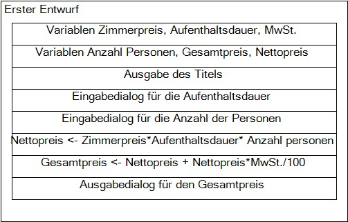

  

        
  

  
 
        <h1>C#-Grundlagen</h1>
        <h3>Arbeitsauftrag zu if-else(if) und switch-case-Anweisungen</h3>

## :dart: Zielsetzung

Dieser Auftrag hat folgende Ziele:

+ Einfache Programmierprobleme nutzen, um die in den Modulen 1, 2, 3 und 4 behandelten Themen zu Vertiefen
+ Üben ein Problem in kleinere Teilprobleme zu zerlegen
+ Üben Informationen zu Recherchieren, die nicht explizit in der Aufgabenstellung genannt werden
+ Üben Sie das Erstellen, Klonen und Einreichen von Aufträgen über Visual Studio 2022 und GitHub

##  :school_satchel: Skills

+ Zerlegung eines Problems in eine Folge einfacher Aufgaben oder Berechnungen
+ Nutzung des Internets, um Informationen oder Formeln zu finden, die zur Lösung von Programmieraufgaben benötigt werden
+ Verwendung von Zuweisungs-Workflow-Schritten

## :bulb: Benötigtes Wissen
+ Konsolenausgabe formatieren und Daten über die Konsole einlesen
+ Verwendung und Konvertierung von Variablen mit unterschiedlichen Datentypen
+ Verarbeitung von Variablen und Literalen durch Operatoren
+ Anweisungen unter verschiedenen Bedingungen

## :bookmark_tabs: Informationsquelle
Das Informationsmaterial zur Aufgabe finden Sie [hier](./AddFiles/Informationsmaterial)
  
---

## Hauptauftrag Hotel-Check-In-App

Der Projektleiter beauftragt Sie ein Programm zu entwickeln, das ein Angebot für Hotelübernachtungen erstellen soll.
Die Analyse des Hauptauftrags ergibt folgende wesentliche Verarbeitungsschritte:

Eingabe von:
- Aufenthaltsdauer
- Anzahl der Personen
- Saison (Frühling = 1, Sommer = 2, Herbst = 3, Winter = 4)
- Zimmerkategorie (Standard = 1, Komfort = 2 und Suit = 3)
- Kundenkategorie (Stammkunde = 1, Firmenkunde = 2, Reisebüro = 3)
- Anzahl der Kinder
- Alter je Kind (0 bis 18)

Der Gesamtpreis wird wie folgt berechnet:
- der Zimmerpreis ist abhängig von Zimmerkategorie, Saison und Anzahl Personen:
Nettopreis?Zimmerpreis*Aufenthaltsdauer*Anzahl Personen
- Wenn der Gast nur eine Übernachtung bestellt, wird ein Zuschlag berechnet. 
- Abhängig von der Kundenkategorie werden unterschiedliche Rabatte gewöhrt.
- Für jedes Kind werden folgende Rabatte angeboten:
-- 0 bis 6 Jahre: 100%
-- 7 bis 11 Jahre: 70%
-- Sonst 30 %
- Gesamtpreis = Nettopreis + Nettopreis*MwSt./100

Am Bildschirm wird Folgendes Ausgegeben: 
- Meldung "Berechnen eines Angebots"
- Preisliste je Zimmerkategorie uns Saison
- Für jede Eingabe wird eine Eingabeaufforderung ausgegeben
- Anzahl der Kinder
- Gesamtpreis 

---

### Aufgabe 1: Hotel-Check-In-App Grundgerüst

In der Enwurfsphase für den ersten Anwendungsfall ist das folgende Struktogramm entstanden. Erstellen Sie für dieses Struktogramm den passenden Programmablaufplan (PAP) und laden sie diesen unter der Dateibezeichnung "HotelCeckInApp_Grundgerüst_PAP.jpg" in den Ordner "AddFiles" hoch.

> :information_source: **Hinweise**:exclamation:
> + Sie müssen das Dateiformat und die Namensgebung einhalten damit die PAP Ihnen hier angezeigt wird.

Struktorgramm und PAP:

---
  
### Aufgabe 2: Hotel-Check-In-App Grundgerüst implementieren

Setzen Sie den Entwurf aus Aufgabe 1 in ein C#-Programm um. Beachten Sie dabei die folgenden Werte.

Zimmerpreis: 70€   
Mehrwertsteuer: 19%
  
> :information_source: **Hinweise**:exclamation:
> + Beachten Sie, dass Sie die Ausgabe unter der gestrichelten Linie erzeugen müssen, um die Aufgabe zu bestehen
> + Die Ausgabe hat nach dem ':' genau 14 Stellen
> + Runden Sie das Ergebnis auf **zwei** Nachkommastelle

Beispiel (Aufenthaltsdauer: 1 Tag / Anzahl der Personen: 2):

  
---

### Aufgabe 3: Hotel-Check-In-App Aufschlag

Wenn der Gast nur eine Übernachtung bestellt, wird ein Zuschlag von 20€ Netto berechnet. Passen Sie Struktorgramm und Programmablaufplan entsprechend an und laden Sie es unter der Bezeichnung "HotelCeckInApp_Aufschlag_STR.jpg" und "HotelCeckInApp_Aufschlag_PAP.jpg" in den Ordner AddFiles hoch. 

> :information_source: **Hinweise**:exclamation:
> + Sie müssen das Dateiformat und die Namensgebung einhalten damit die PAP Ihnen hier angezeigt wird.

---

### Aufgabe 4: Hotel-Check-In-App Aufschlag implementieren

Setzen Sie den Entwurf aus Aufgabe 3 in ein C#-Programm um. Beachten Sie dabei die folgenden Werte.

Zimmerpreis: 70€   
Mehrwertsteuer: 19%

> :information_source: **Hinweise**:exclamation:
> + Beachten Sie, dass Sie die Ausgabe unter der gestrichelten Linie erzeugen müssen, um die Aufgabe zu bestehen
> + Die Ausgabe hat nach dem ':' genau 14 Stellen
> + Runden Sie das Ergebnis auf **zwei** Nachkommastelle

Beispiel (Aufenthaltsdauer: 1 Tag / Anzahl der Personen: 2):

---
  
### Aufgabe 5: Arbeit einreichen

1. In Visual Studio 2022 das Fenster "Git-Änderungen" aufrufen
2. Eine kurze Beschreibung Ihrer Änderungen in die Textbox eingeben und "commit für alle" klicken
3. Mit dem Pfeil nach oben die Arbeit auf GitHub pushen.
4. Das Repository im Brower aufrufen und aktualisieren um die Änderungen zu bestätigen.
5. Im Pull-Request die Nachricht "Bereit zum Bewerten" hinterlassen, damit Ihre Lehrkraft weiss das Sie fertig sind.

---
  
# :100: Erfolgskriterien
  
+ Eingesetzten Quellcode kommentieren
+ Quellcode schreiben der lesbar ist und mit Hilfe einer logischen Folge das Problem löst
+ Programmausgabe die korrekt, lesbar und richtig formatiert ist 
