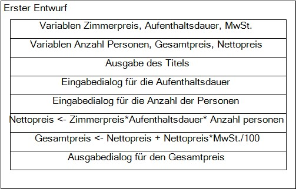
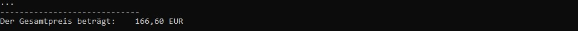
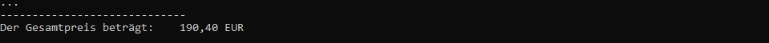

<div id="container" style="white-space:nowrap">

  <div id="image" style="display:inline float: right;">
        
  </div>

  <div id="texts" style="display:inline; white-space:nowrap; float: right;"> 
        <h1>C#-Grundlagen</h1>
        <h3>Arbeitsauftrag zu if-else(if) und switch-case-Anweisungen</h3>
</div>

---

## Hauptauftrag Hotel-Check-In-App

Während Ihres Praktikums in einem Softwareunternehmen entwickeln Sie eine Hotel-Check-In-App. Ihr Projektleiter hat Sie damit beauftragt, ein Programm zu erstellen, das anhand der Eingaben des Gastes den Preis für eine Hotelübernachtung berechnet und ein Angebot ausgibt.

Die Analyse des Hauptauftrags ergibt folgende wesentliche Verarbeitungsschritte:

Eingabe von:
- Aufenthaltsdauer
- Anzahl der Personen
- Saison (Frühling = 1, Sommer = 2, Herbst = 3, Winter = 4)
- Zimmerkategorie (Standard = 1, Komfort = 2 und Suit = 3)


Der Gesamtpreis wird wie folgt berechnet:
- der Zimmerpreis ist abhängig von Zimmerkategorie 
- je nach Sesaon wird auf den Nettopreis ein Zuschlag berechnet
  
Nettopreis=Zimmerpreis*Aufenthaltsdauer*Anzahl Personen
- Wenn der Gast nur eine Übernachtung bestellt, wird ein Zuschlag berechnet. 

- Gesamtpreis = Nettopreis + Nettopreis*MwSt./100

Am Bildschirm wird Folgendes Ausgegeben: 
- Meldung "Berechnen eines Angebots"
- Preisliste je Zimmerkategorie uns Saison
- Für jede Eingabe wird eine Eingabeaufforderung ausgegeben
- Gesamtpreis 

Ihr Projektleiter hat ihnen einige Informationen zusammengestellt und die notwendigen Verarbeitungsschritte für Sie vorstrukturiert.


## :bookmark_tabs: Informationsquelle

- [Informationsmaterial](./AddFiles/Informationsmaterial)
- [GSO-WIKI](https://github.com/GSO-SW/public_content_gso/wiki)


---

### Aufgabe 1: Hotel-Check-In-App Grundgerüst (Einzelarbeit :busts_in_silhouette:)

In der Enwurfsphase für den ersten Anwendungsfall ist das folgende Struktogramm entstanden. Erstellen Sie für dieses Struktogramm den passenden Programmablaufplan (PAP) und laden sie diesen unter der Dateibezeichnung "HotelCeckInApp_Grundgerüst_PAP.jpg" in den Ordner "AddFiles" hoch.


> :information_source: **Hinweise**:exclamation:
> + Sie müssen das Dateiformat und die Namensgebung einhalten damit die PAP Ihnen hier angezeigt wird.

Struktorgramm und PAP:



---
  
### Aufgabe 2: Hotel-Check-In-App Grundgerüst implementieren (Einzelarbeit :bust_in_silhouette:)

Setzen Sie den Entwurf aus Aufgabe 1 in ein C#-Programm um. Beachten Sie dabei die folgenden Werte.

Zimmerpreis: 70€   
Mehrwertsteuer: 19%
  
> :information_source: **Hinweise**:exclamation:
> + Beachten Sie, dass Sie die Ausgabe unter der gestrichelten Linie erzeugen müssen, um die Aufgabe zu bestehen
> + Die Ausgabe hat nach dem ':' genau 14 Stellen
> + Runden Sie das Ergebnis auf **zwei** Nachkommastelle


Beispiel (Aufenthaltsdauer: 1 Tag / Anzahl der Personen: 2):


  
---

### Aufgabe 3: Hotel-Check-In-App Aufschlag (Partnerarbeit :busts_in_silhouette:)

Wenn der Gast nur eine Übernachtung bestellt, wird ein Zuschlag von 20€ Netto berechnet. Passen Sie den Programmablaufplan entsprechend an und laden Sie es unter der Bezeichnung "HotelCeckInApp_Aufschlag_PAP.jpg" in den Ordner AddFiles hoch. 


> :information_source: **Hinweise**:exclamation:
> + Sie müssen das Dateiformat und die Namensgebung einhalten damit die PAP Ihnen hier angezeigt wird.

---

### Aufgabe 4: Hotel-Check-In-App Aufschlag implementieren (Einzelarbeit :bust_in_silhouette:)

Setzen Sie den Entwurf aus Aufgabe 3 in ein C#-Programm um. Beachten Sie dabei die folgenden Werte.

Zimmerpreis: 70€   
Mehrwertsteuer: 19%


> :information_source: **Hinweise**:exclamation:
> + Beachten Sie, dass Sie die Ausgabe unter der gestrichelten Linie erzeugen müssen, um die Aufgabe zu bestehen
> + Die Ausgabe hat nach dem ':' genau 14 Stellen
> + Runden Sie das Ergebnis auf **zwei** Nachkommastelle


Beispiel (Aufenthaltsdauer: 1 Tag / Anzahl der Personen: 2):



---

### Aufgabe 5: Hotel-Check-In-App Aufschlag (Partnerarbeit :busts_in_silhouette:)

Erwiterns Sie die PAP aus auf gabe 3 um folgende Punkte:

- Zimmerkategorie Standard (70€), Komfort (100€) und Suit (200€)
- Saison Frühling (+5%), Sommer (+8%), Herbst (0%), Winter (-10%)


Passen Sie den Programmablaufplan entsprechend an und laden Sie es unter der Bezeichnung "HotelCeckInApp_Final_PAP.jpg" in den Ordner AddFiles hoch. 


> :information_source: **Hinweise**:exclamation:
> + Sie müssen das Dateiformat und die Namensgebung einhalten damit die PAP Ihnen hier angezeigt wird.

---

### Aufgabe 6: Hotel-Check-In-App Kategorien und Saison (Einzelarbeit :bust_in_silhouette:)

Setzen Sie den Entwurf aus Aufgabe 5 in ein C#-Programm um. Beachten Sie dabei die folgenden Werte.

---

### Sprinteraufgabe: Rechnung formatiert ausgeben (Einzelarbeit :bust_in_silhouette:)

```text
=============================
      HOTEL-ANGEBOT
=============================
Zimmer:        Komfort
Saison:        Sommer
Personen:      2
Nächte:        5
Nettopreis:    1000,00 €
Saisonzuschlag:  80,00 €
Aufschlag:       20,00 €
MwSt. (19%):   209,00 €
-----------------------------
Gesamtpreis:  1309,00 €
=============================
Vielen Dank für Ihre Buchung!
```

---
  
### Aufgabe 7: Arbeit einreichen

1. In Visual Studio 2022 das Fenster "Git-Änderungen" aufrufen
2. Eine kurze Beschreibung Ihrer Änderungen in die Textbox eingeben und "commit für alle" klicken
3. Mit dem Pfeil nach oben die Arbeit auf GitHub pushen.
4. Das Repository im Brower aufrufen und aktualisieren um die Änderungen zu bestätigen.
5. Im Pull-Request die Nachricht "Bereit zum Bewerten" hinterlassen, damit Ihre Lehrkraft weiss das Sie fertig sind.

---
  
# :100: Erfolgskriterien
  
+ Eingesetzten Quellcode kommentieren
+ Quellcode schreiben der lesbar ist und mit Hilfe einer logischen Folge das Problem löst
+ Programmausgabe die korrekt, lesbar und richtig formatiert ist 
